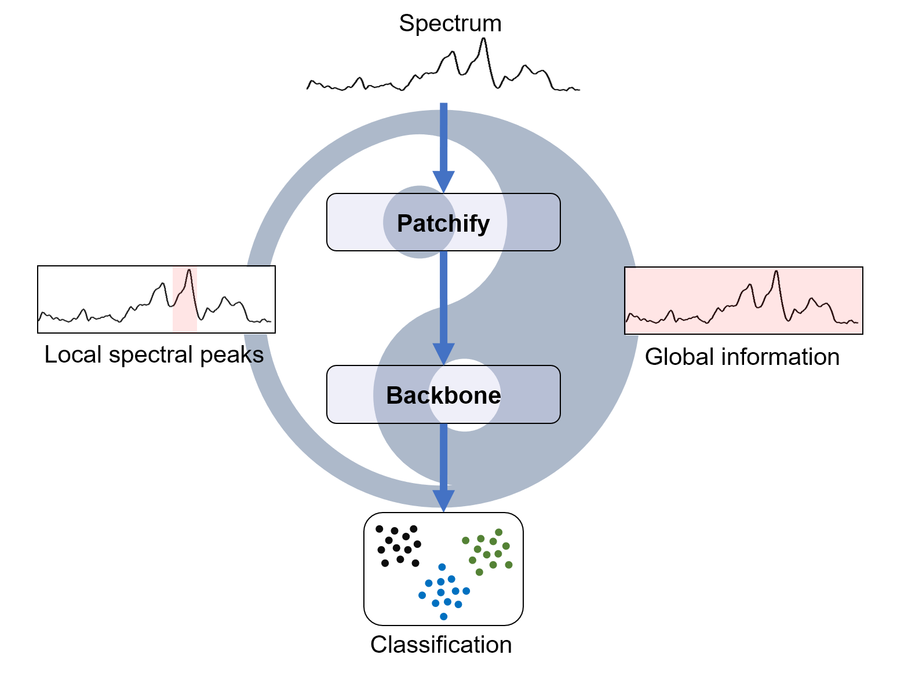
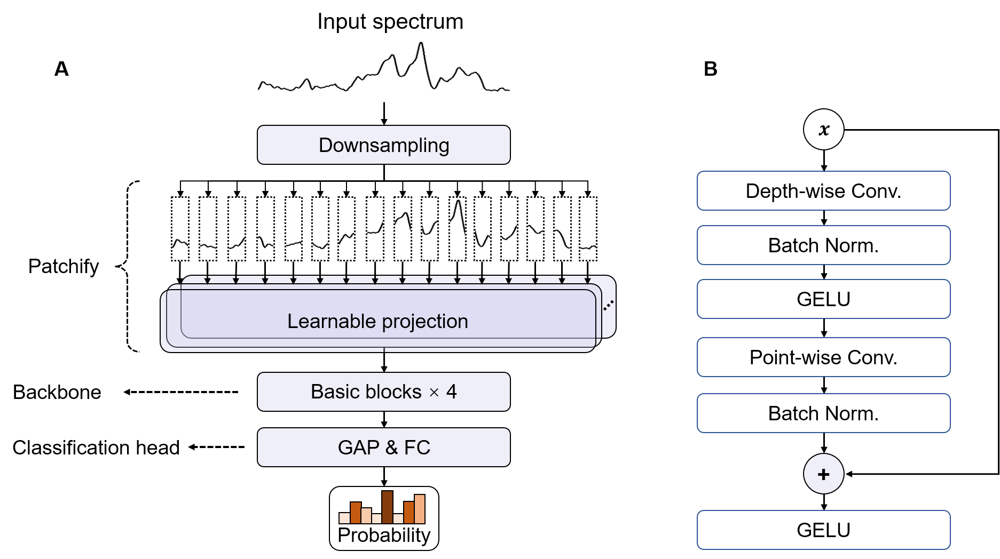

# PACE: a deep learning algorithm for spectral classification balancing the local and global information

## Abstract

Molecular vibrational spectroscopies, including infrared absorption and Raman scattering, provide molecular fingerprint information and are powerful tools for qualitative and quantitative analysis. They are benefited from the recent development of deep learning-based algorithms to improve the spectral, spatial and temporal resolutions. **Although a variety of deep learning-based algorithms, including those to simultaneously extract the global and local spectral features, have been developed for spectral classification, the classification accuracy is still far from satisfactory when the difference becomes very subtle.** Here, we developed a lightweight algorithm named Patch-based Convolutional Encoder (PACE), which effectively improved the accuracy of spectral classification by extracting spectral features with balancing local and global information. The local information was well captured by segmenting the spectrum into patches with an appropriate patch size. The global information was extracted by constructing the correlation between different patches with depthwise separable convolutions. In the five open-source spectral datasets, PACE achieved the state-of-the-art performance. The more difficult the classification, the better the performance of PACE, compared with that by Residual Neural Network (ResNet), Vision Transformer (ViT) and other commonly used deep learning algorithms. PACE helped improve the accuracy to 92.1% in Raman identification of pathogen-derived extracellular vesicles (EVs) at different physiological states, which is much better than that by ResNet (85.1%) and ViT (86.0%). In general, the precise recognition and extraction of subtle differences offered by PACE is expected to facilitate vibrational spectroscopy to be a powerful tool towards revealing the relevant chemical reaction mechanisms in surface science or realizing the early diagnosis in life science.



## Model Architecture

## Datasets

Raman Datasets
+ [COVID-19](https://springernature.figshare.com/articles/dataset/Data_and_code_on_serum_Raman_spectroscopy_as_an_efficient_primary_screening_of_coronavirus_disease_in_2019_COVID-19_/12159924/1)
+ [Marine Pathogens](https://pubs.acs.org/doi/full/10.1021/acs.analchem.1c00431)
+ [RRUFF](https://rruff.info/zipped_data_files/raman/)
+ [Bacteria](https://www.nature.com/articles/s41467-019-12898-9)

IR Dataset
+ [Functional Groups](https://pubs.rsc.org/en/content/articlelanding/2020/SC/C9SC06240H)

**Note: These datasets are available in this repo [here](https://github.com/X1nyuLu/PACE/tree/main/datasets). However, RRUFF and FunctionalGroups (NIST) are not updated!**  
## Requirements
we recommend using a virtual environment to run the code. You can create a virtual environment using the following command:
```bash
conda create -f environment.yml
conda activate PACE
```

## How to train the model

```python 
python main.py -train --ds {DATASET_NAME} --net {MODEL_NAME} 
```
For example:
```python
python main.py -train --ds COV --net PACE --patch_size 16 --deepth 4 --pool_dim 256 --batch_size 64 --epochs 200 --train_size 0.8
```

## How to test the model

```python
python main.py -test --ds {DATASET_NAME} --net {MODEL_NAME} --test_checkpoint {MODEL_PATH}
```
For example:
```python
python main.py -test --ds COV --net PACE --test_checkpoint checkpoints/COV/PACE/924.pth
```

## How to cite

If you find this work useful, please cite our paper [here]().
